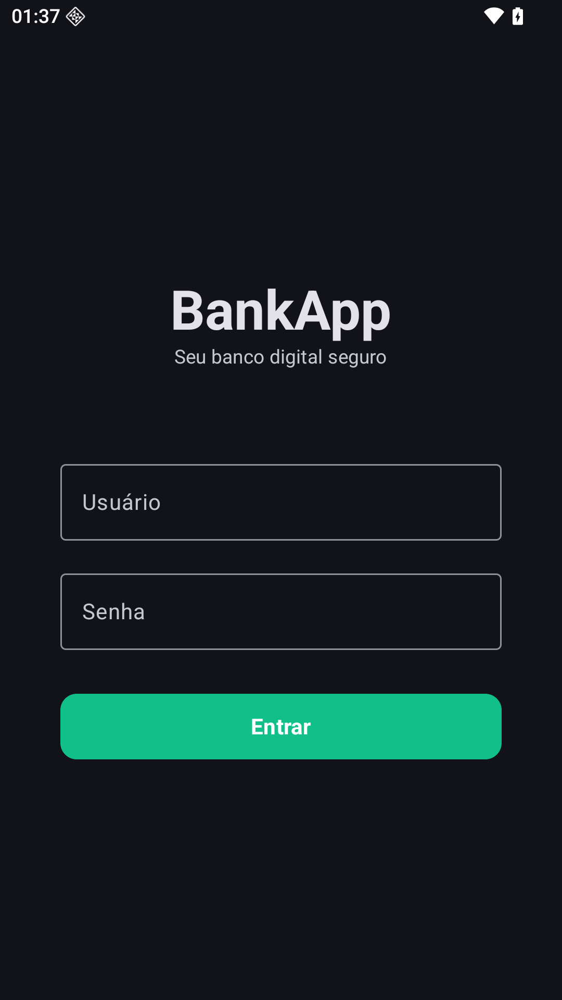
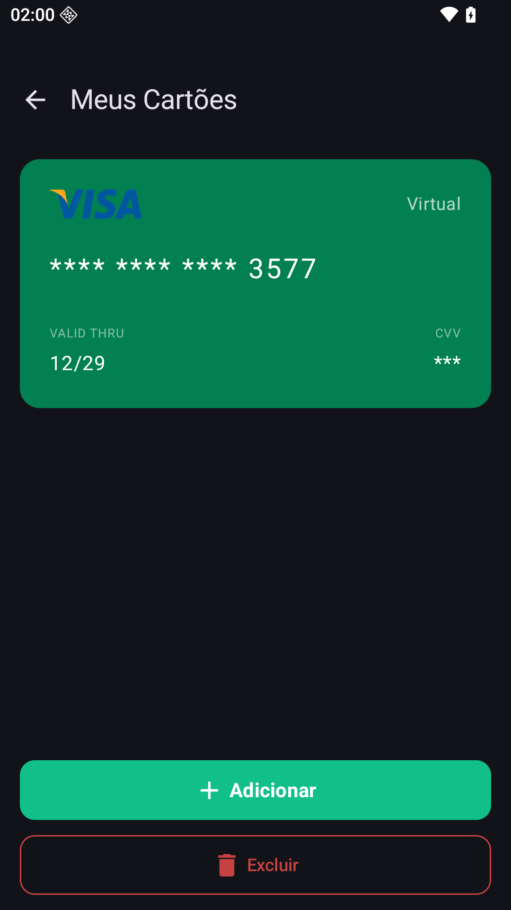

# BankApp

Aplicativo Android de banco digital, desenvolvido com **Kotlin + Jetpack Compose**, com foco em arquitetura **MVVM**, navegação entre telas, persistência local e integração com APIs.

## Visão Geral

O **BankApp** é um projeto mobile que demonstra práticas modernas de desenvolvimento Android, incluindo:

- Interface declarativa com Compose
- Organização em camadas com MVVM
- Injeção de dependência
- Comunicação com serviços HTTP
- Persistência local com banco de dados e preferências
- Funcionalidades de cartão (incluindo leitura/scan)
- Funcionalidades de Criptomoedas (visualização de cotações, compra e venda)

---

## Tecnologias Utilizadas

### Plataforma e linguagem
- **Kotlin**
- **Android SDK**
    - `compileSdk = 36`
    - `targetSdk = 35`
    - `minSdk = 24`
- **Gradle Kotlin DSL** (`.kts`)
- **KSP (Kotlin Symbol Processing)** para geração de código (Room)

### UI
- **Jetpack Compose**
- **Material 3**
- **Material Icons Extended**
- **AndroidX Activity Compose**

### Navegação
- **AndroidX Navigation Compose**
- **AndroidX Navigation UI KTX**

### Arquitetura e estado
- **MVVM (Model-View-ViewModel)**
- **Lifecycle Runtime KTX**

### Dados locais
- **Room**
- **DataStore Preferences**

### Rede e comunicação
- **Retrofit**
- **Gson Converter** (serialização/deserialização JSON)

### Escaneamento de cartão
- **ScanCard** (`com.github.Gustavo-MedeirosS:ScanCard`) para leitura/extração de dados de cartão

---

## Bibliotecas e Versões (catálogo Gradle)

As versões são centralizadas em `gradle/libs.versions.toml`. Principais itens:

- AGP: `9.1.1`
- Kotlin Compose Plugin: `2.2.10`
- KSP: `2.1.0-1.0.29`
- Compose BOM: `2024.09.00`
- Navigation Compose/UI KTX: `2.9.8`
- Retrofit: `3.0.0`
- Room: `2.8.4`
- DataStore Preferences: `1.2.1`
- Material: `1.14.0`
- ScanCard: `1.1.0`

---

## Funcionalidades do Projeto

> A lista abaixo descreve o escopo funcional suportado pela stack e dependências configuradas no projeto.

- Navegação entre telas com fluxo Compose Navigation
- Interface moderna com componentes Material 3
- Consumo de APIs REST com Retrofit
- Conversão de payloads JSON com Gson
- Persistência estruturada em banco local com Room
- Armazenamento de preferências/configurações com DataStore
- Recurso de **scan de cartão** via biblioteca ScanCard

---

## Arquitetura MVVM no BankApp

A aplicação segue o padrão **MVVM**, separando responsabilidades para melhorar manutenção, escalabilidade e testes.

### Model
Responsável por dados e regras de acesso:
- Fontes remotas (API via Retrofit)
- Fontes locais (Room/DataStore)
- Entidades, DTOs e mapeamentos
- Repositórios (ponte entre ViewModel e fontes de dados)

### ViewModel
Camada de orquestração de estado e regras de apresentação:
- Recebe eventos da View (cliques, intents de UI)
- Chama casos de uso/repositórios
- Expõe estado observável para a tela
- Trata erros e loading de forma centralizada

### View (Compose)
Camada de interface:
- Renderiza estado vindo da ViewModel
- Dispara eventos de interação do usuário
- Não contém regra de negócio

### Fluxo de dados (resumo)

1. Usuário interage com a tela Compose
2. A View envia o evento para a ViewModel
3. A ViewModel consulta o repositório
4. O repositório decide entre API (Retrofit) e cache/local (Room/DataStore)
5. O resultado retorna para ViewModel
6. A ViewModel atualiza o estado
7. A Compose recompõe automaticamente com os novos dados

---

## Comunicação entre Camadas

No contexto do projeto, a comunicação segue o padrão abaixo:

- **UI -> ViewModel:** eventos de interface
- **ViewModel -> Repositório:** chamadas de operações de negócio
- **Repositório -> Data Source (Remote/Local):** acesso a API e banco local
- **Data Source -> ViewModel:** retorno de dados/erros (transformados para estado de UI)
- **ViewModel -> UI:** estado observável para renderização

Esse modelo reduz acoplamento direto entre UI e infraestrutura, favorecendo evolução de features e testes.

---

## Boas Práticas Aplicadas

- Catálogo de versões (`libs.versions.toml`) para governança de dependências
- Separação de responsabilidades com MVVM
- Persistência local desacoplada da UI
- Navegação declarativa com Compose
- Centralização de strings e internacionalização
- Uso de Material Design para consistência visual
- Tratamento de erros e estados de loading na ViewModel

---

## Screenshots

| Tela         | Preview                                      |
|--------------|----------------------------------------------|
| Home         |          |
| Home         |            |
| Cartões      |      |
| Criptomoedas |  |
| Extrato      |      |

---